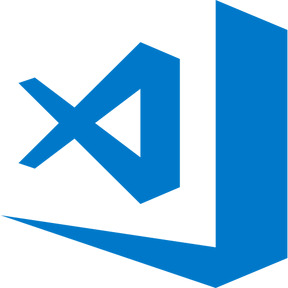

### Hi there 👋
-----------
<!-- **DAguirreAg/DAguirreAg** is a ✨ _special_ ✨ repository because its `README.md` (this file) appears on your GitHub profile. -->

My name is Daniel and welcome to my Github page! This is one of the places where I opensource some of my projects. 

I am an Idustrial Engineer who lives and works in the Netherlands :netherlands:. Even though I work as a data engineer and analyst, I spend a decent amount of time coding just for fun. If you want to connect or just discuss anything, just drop me a message here or in my other Social Media platforms (links below).
 

### 🔧 Languages and Tools:

 
 
 

### :man: About me

- 🔭 I’m currently working on: **Smart Manufacturing** and **Home Automation APPs**.
- 🌱 I’m currently learning about how to design and setup a home server.
- 👯 I’m looking to collaborate on projects related with Data and/or Industry 4.0.
- 💬 Ask me about **Data analysis/engineering and Industry 4.0**.
- 📫 How to reach me: Linkedin and Github!
- ⚡ Fun fact: I studied Mech. Eng. even though I work on software.

### :link: Connect with me:

[][linkedin]

[][github]
 
 

### 📊 GitHub Stats:

<!--

-->

[linkedin]: www.linkedin.com/in/daniel-aguirre-aguirrebena
[github]: https://github.com/DAguirreAg
